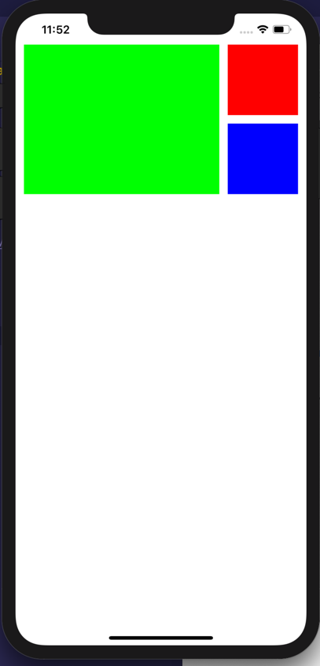

# Advanced Swift: Making Programmatic Auto Layout Easy through Extensions

## Credit

    Brain Voong (Lets Build that App)

## Tutorial

- [YouTube Tutorial](https://www.youtube.com/watch?v=iqpAP7s3b-8)

## Example Layout

## Explanation

- anchors were introduced in `ios 9`.

- anchors help us to set constraints Programmatically in a much cleaner and nicer way.

- `safeArea` is new from `iPhone 10` family. because of the notches and no home button.

- `leadingAnchor` is going to be left side.

- `trailingAnchor` is going to be right side.
